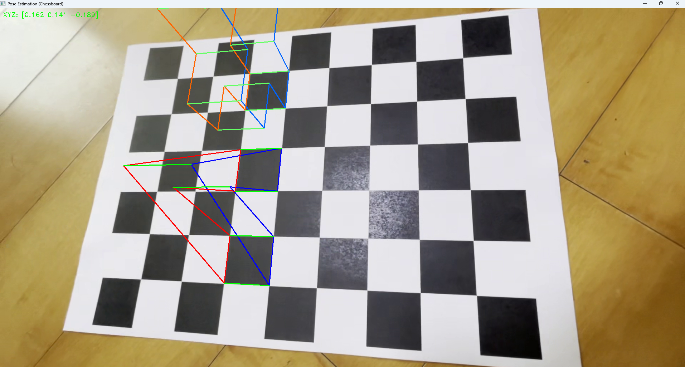
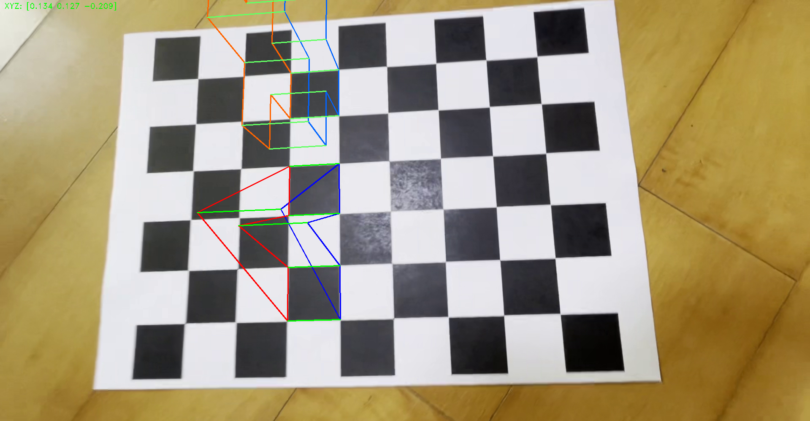
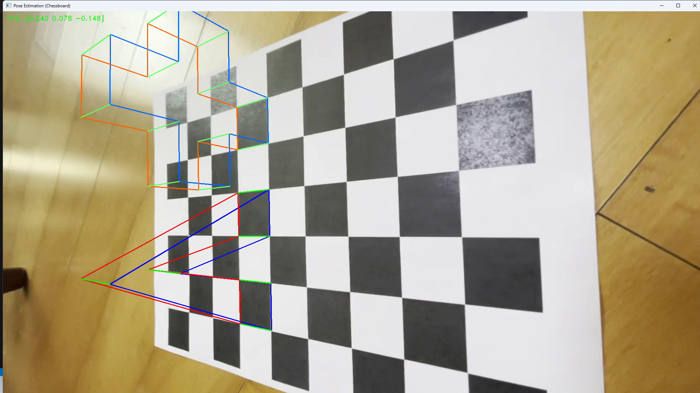
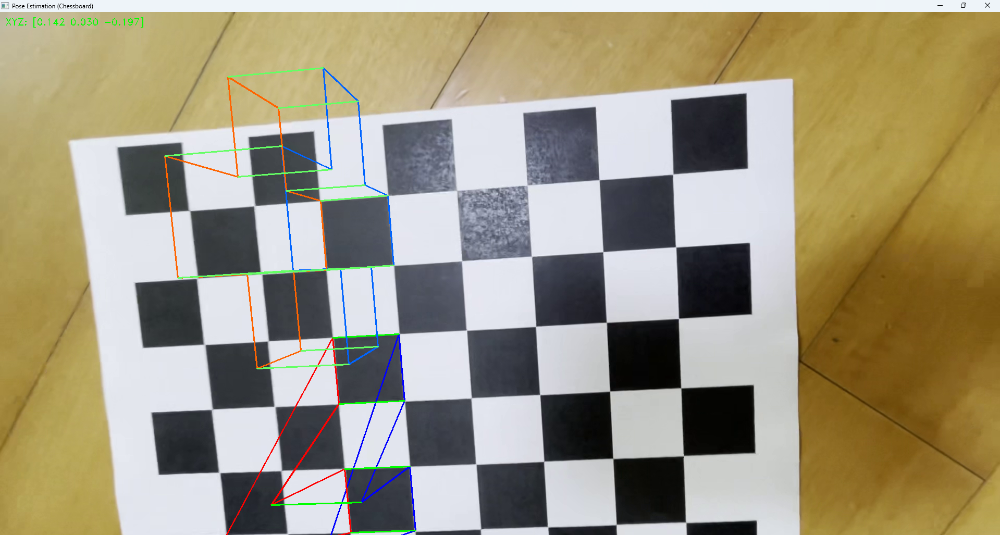

# 📌 Pose Estimation & AR

OpenCV를 사용해 체스보드 기반의 카메라 자세 추정을 수행하고,  
체스보드 위에 다양한 3D AR 객체를 시각화하는 프로젝트입니다.

## 🎯 주요 기능
- 체스보드 영상에서 카메라 자세 추정
- 3D 오브젝트 체스보드 위에 투영 (해당 코드에선 'A+' 오브젝트 확인 가능)
- 실시간 프레임 출력
- 키보드 조작:
  - `ESC`: 종료
  - `Space`: 일시 정지
 
## 결과

